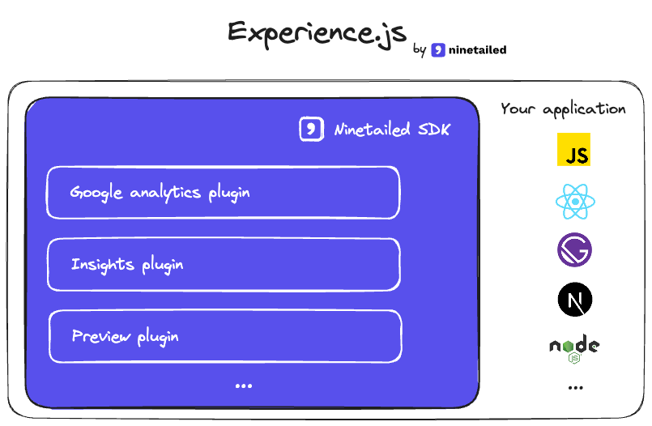

<!-- # Experience.js -->
<!-- 

  

 -->

  

Ninetailed's plugins and Software Development Kits (SDKs) for JavaScript, Node.js, and popular frameworks such as React, Next.js, Gatsby, etc.

## Examples

Here are some examples on how to use the SDKs:

- [ninetailed-examples repository](https://github.com/ninetailed-inc/ninetailed-examples).

## Contribute

In order to get started, first read through our [Contributing guidelines](./CONTRIBUTING.md).

## License

[MIT](./LICENSE)
