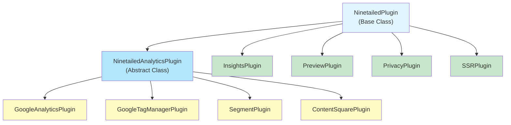

# Ninetailed Plugins

Plugins are the extensibility mechanism for the Ninetailed Experience.js SDK. They allow you to integrate with third-party analytics platforms, add custom functionality, and extend the SDK's capabilities to meet your specific needs.

## Table of Contents

- [What are Plugins?](#what-are-plugins)
- [Plugin Architecture](#plugin-architecture)
- [Available Plugins](#available-plugins)
- [Plugin Hierarchy](#plugin-hierarchy)
- [Building Custom Plugins](#building-custom-plugins)

## What are Plugins?

Plugins are JavaScript/TypeScript classes that extend the Ninetailed SDK's functionality. They can:

- **Track analytics events** to third-party platforms (Google Analytics, Segment, etc.)
- **Modify SDK behavior** through middleware (experience selection, changes modification)
- **React to SDK events** (profile changes, element visibility, etc.)
- **Add UI components** (preview widgets, consent banners)
- **Handle cross-cutting concerns** (privacy, SSR, cookie management)

### Why Use Plugins?

Plugins provide a clean separation of concerns, allowing you to:

- **Integrate with your existing analytics stack** without modifying core SDK code
- **Customize behavior** for your specific use cases
- **Maintain modularity** by keeping integrations isolated
- **Enable/disable features** based on your needs

### How Plugins Integrate with the SDK

Plugins are registered when initializing the Ninetailed SDK:

```typescript
import { Ninetailed } from '@ninetailed/experience.js';
import { NinetailedGoogleAnalyticsPlugin } from '@ninetailed/experience.js-plugin-google-analytics';

const ninetailed = new Ninetailed(
  { clientId: 'your-client-id', environment: 'main' },
  {
    plugins: [
      new NinetailedGoogleAnalyticsPlugin(),
      // ... other plugins
    ],
  }
);
```

The SDK automatically:
- Initializes plugins when ready
- Passes credentials to plugins that need them
- Sets component view tracking thresholds
- Injects event builders when required
- Routes events to appropriate plugin handlers

## Plugin Architecture

### Base Classes

The plugin system is built on two main base classes:

#### `NinetailedPlugin`

The foundational base class for all plugins. It provides:

- **Event handlers** for element and variable visibility tracking
- **Component view tracking threshold** management
- **Integration** with the analytics library event system

```typescript
import { NinetailedPlugin } from '@ninetailed/experience.js-plugin-analytics';

export class MyCustomPlugin extends NinetailedPlugin {
  public readonly name = 'my-custom-plugin';

  // Override to handle when elements are seen
  protected onHasSeenElement(event) {
    // Your custom logic
  }

  // Override to handle when variables are seen
  protected onHasSeenVariable(event) {
    // Your custom logic
  }
}
```

**Key Features:**
- Implements `AnalyticsPlugin` interface from the analytics library
- Handles `has_seen_element` and `has_seen_variable` events
- Supports component view tracking thresholds
- Provides event handler utilities

#### `NinetailedAnalyticsPlugin`

An abstract class that extends `NinetailedPlugin` specifically for analytics integrations. It adds:

- **Experience tracking** with template-based event payload generation
- **Deduplication** of seen elements/variables
- **Sanitized payload handling** for type safety

```typescript
import { NinetailedAnalyticsPlugin, Template } from '@ninetailed/experience.js-plugin-analytics';

export class MyAnalyticsPlugin extends NinetailedAnalyticsPlugin {
  public readonly name = 'my-analytics-plugin';

  constructor(template?: Template) {
    super(template);
  }

  // Required: Implement how to track experiences
  protected async onTrackExperience(properties, eventPayload) {
    // Send to your analytics platform
  }

  // Optional: Implement component tracking (deprecated)
  protected async onTrackComponent(properties) {
    // Legacy component tracking
  }
}
```

**Key Features:**
- Template-based event payload generation using `{{variable}}` syntax
- Automatic deduplication of tracked experiences
- Sanitized payload validation using Zod schemas
- Support for both experience and component tracking

### Plugin Lifecycle

Plugins follow a specific lifecycle:

1. **Instantiation** - Plugin is created with constructor options
2. **Registration** - Plugin is added to the SDK's plugin array
3. **Initialization** - SDK calls `initialize({ instance })` if implemented
4. **Event Handling** - Plugin receives events based on implemented interfaces
5. **Cleanup** - Plugin can implement cleanup logic if needed

### Available Interfaces

Plugins can implement various interfaces to hook into different SDK events:

| Interface | Purpose | Example Use Case |
|-----------|---------|------------------|
| `InterestedInProfileChange` | React to profile updates | Update UI when profile changes |
| `InterestedInSeenElements` | React to element visibility | Track component views |
| `InterestedInSeenVariables` | React to variable visibility | Track variable usage |
| `InterestedInHiddenPage` | React to page visibility changes | Flush events when page hidden |
| `HasExperienceSelectionMiddleware` | Modify experience selection | Preview plugin override variants |
| `HasChangesModificationMiddleware` | Modify changes before application | Preview plugin override variables |
| `AcceptsCredentials` | Receive SDK credentials | Insights plugin API authentication |
| `RequiresEventBuilder` | Need event builder injection | Insights plugin event construction |

## Available Plugins

### Analytics Plugins

These plugins extend `NinetailedAnalyticsPlugin` and send experience tracking data to third-party analytics platforms.

#### `@ninetailed/experience.js-plugin-google-analytics`

Sends experience events to Google Analytics via the `gtag` function.

**Use Case:** Track Ninetailed experiences in Google Analytics for reporting and analysis.

**Configuration:**
```typescript
import { NinetailedGoogleAnalyticsPlugin } from '@ninetailed/experience.js-plugin-google-analytics';

const plugin = new NinetailedGoogleAnalyticsPlugin({
  actionTemplate: 'Has Seen Experience - Audience:{{ audience.id }}',
  labelTemplate: '{{ baselineOrVariant }}:{{ component.id }}',
});
```

**Requirements:**
- Google Analytics must be initialized with `gtag` available on `window`

**Dependencies:**
- `@ninetailed/experience.js-plugin-analytics`

---

#### `@ninetailed/experience.js-plugin-google-tagmanager`

Pushes experience events to Google Tag Manager's `dataLayer`.

**Use Case:** Send Ninetailed data to GTM for flexible tag management and routing to multiple destinations.

**Configuration:**
```typescript
import { NinetailedGoogleTagmanagerPlugin } from '@ninetailed/experience.js-plugin-google-tagmanager';

const plugin = new NinetailedGoogleTagmanagerPlugin({
  template: {
    custom_property: '{{experience.name}}',
  },
  actionTemplate: 'Custom Action',
  labelTemplate: '{{selectedVariantSelector}}',
});
```

**Default Event Payload:**
```javascript
{
  event: 'nt_experience',
  ninetailed_variant: 'control' | 'variant 1',
  ninetailed_experience: 'experience-id',
  ninetailed_experience_name: 'Experience Name',
  ninetailed_audience: 'audience-id',
  ninetailed_component: 'component-id'
}
```

**Dependencies:**
- `@ninetailed/experience.js-plugin-analytics`

---

#### `@ninetailed/experience.js-plugin-segment`

Sends experience events to Segment's analytics platform.

**Use Case:** Route Ninetailed events through Segment to multiple downstream analytics tools.

**Configuration:**
```typescript
import { NinetailedSegmentPlugin } from '@ninetailed/experience.js-plugin-segment';
import { AnalyticsBrowser } from '@segment/analytics-next';

const segmentAnalytics = AnalyticsBrowser.load({ writeKey: 'your-key' });

const plugin = new NinetailedSegmentPlugin({
  analytics: segmentAnalytics, // Optional: pass custom instance
  template: {
    custom_property: '{{experience.name}}',
  },
  eventNameTemplate: 'Has Seen Experience',
  categoryPropertyTemplate: 'Ninetailed',
});
```

**Default Event Payload:**
```javascript
{
  event: 'nt_experience',
  ninetailed_variant: 'control' | 'variant 1',
  ninetailed_experience: 'experience-id',
  ninetailed_experience_name: 'Experience Name',
  ninetailed_audience: 'audience-id',
  ninetailed_component: 'component-id'
}
```

**Dependencies:**
- `@ninetailed/experience.js-plugin-analytics`
- Segment analytics instance (can be passed or auto-detected from `window.analytics`)

---

#### `@ninetailed/experience.js-plugin-contentsquare`

Pushes experience events to ContentSquare's data layer.

**Use Case:** Track Ninetailed experiences in ContentSquare for behavioral analytics and heatmaps.

**Configuration:**
```typescript
import { NinetailedContentsquarePlugin } from '@ninetailed/experience.js-plugin-contentsquare';

const plugin = new NinetailedContentsquarePlugin({
  actionTemplate: 'nt_experience',
});
```

**Event Format:**
Events are pushed to `window.ninetailed.plugins.contentsquare.dataLayer` array.

**Dependencies:**
- `@ninetailed/experience.js-plugin-analytics`

---

### Core Plugins

These plugins extend `NinetailedPlugin` directly and provide core SDK functionality.

#### `@ninetailed/experience.js-plugin-insights`

Sends component view events to the Ninetailed Insights API for analytics and reporting.

**Use Case:** Track component views for Ninetailed's built-in analytics dashboard.

**Configuration:**
```typescript
import { NinetailedInsightsPlugin } from '@ninetailed/experience.js-plugin-insights';

const plugin = new NinetailedInsightsPlugin({
  url: 'https://api.ninetailed.io', // Optional custom API URL
});
```

**Features:**
- Batches events (up to 25 events per batch)
- Automatically flushes on profile changes
- Uses beacon API when page becomes hidden
- Requires credentials (automatically injected by SDK)

**Interfaces Implemented:**
- `InterestedInSeenElements`
- `InterestedInSeenVariables`
- `InterestedInProfileChange`
- `InterestedInHiddenPage`
- `AcceptsCredentials`
- `RequiresEventBuilder`

**Dependencies:**
- `@ninetailed/experience.js-plugin-analytics`
- `@ninetailed/experience.js` (for event builder)

---

#### `@ninetailed/experience.js-plugin-preview`

Provides a preview UI widget for testing and debugging experiences in development.

**Use Case:** Enable content editors and developers to preview different experience variants, activate audiences, and test personalization.

**Configuration:**
```typescript
import { NinetailedPreviewPlugin } from '@ninetailed/experience.js-plugin-preview';

const plugin = new NinetailedPreviewPlugin({
  experiences: experienceConfigs,
  audiences: audienceDefinitions,
  url: 'https://preview.ninetailed.io',
  nonce: 'preview-nonce',
  ui: {
    position: 'bottom-right',
  },
  onOpenExperienceEditor: (experience) => {
    // Custom handler
  },
  onOpenAudienceEditor: (audience) => {
    // Custom handler
  },
});
```

**Features:**
- Visual widget for previewing experiences
- Override experience variant selection
- Activate/deactivate audiences
- Override variable values
- Modify changes through middleware
- Window API: `window.ninetailed.plugins.preview`

**Interfaces Implemented:**
- `HasExperienceSelectionMiddleware`
- `HasChangesModificationMiddleware`
- `InterestedInProfileChange`

**Dependencies:**
- `@ninetailed/experience.js-plugin-analytics`
- `@ninetailed/experience.js-preview-bridge`

---

#### `@ninetailed/experience.js-plugin-privacy`

Handles privacy and consent management, controlling what data can be tracked.

**Use Case:** Comply with GDPR, CCPA, and other privacy regulations by controlling event tracking based on user consent.

**Configuration:**
```typescript
import { NinetailedPrivacyPlugin } from '@ninetailed/experience.js-plugin-privacy';

const plugin = new NinetailedPrivacyPlugin(
  {
    // Default (no consent) configuration
    allowedEvents: ['page'],
    allowedPageEventProperties: ['*'],
    allowedTrackEvents: [],
    allowedTrackEventProperties: [],
    allowedTraits: [],
    blockProfileMerging: true,
    enabledFeatures: [],
  },
  {
    // Accepted consent configuration
    allowedEvents: ['page', 'track', 'identify', 'component'],
    allowedPageEventProperties: ['*'],
    allowedTrackEventProperties: ['*'],
    allowedTrackEvents: ['*'],
    allowedTraits: ['*'],
    blockProfileMerging: false,
    enabledFeatures: Object.values(FEATURES),
  }
);
```

**Features:**
- Blocks events based on consent status
- Filters event properties and traits
- Controls profile merging
- Enables/disables SDK features
- Window API: `window.ninetailed.consent(accepted: boolean)`

**Event Filtering:**
- Supports wildcard patterns (`*`) for property matching
- Blocks `COMPONENT_START` events when consent not given
- Queues blocked events (can be replayed after consent)

**Dependencies:**
- `@ninetailed/experience.js-plugin-analytics`

---

#### `@ninetailed/experience.js-plugin-ssr`

Manages anonymous ID synchronization between server and client for SSR applications.

**Use Case:** Maintain consistent user identification across server-side rendering and client-side hydration.

**Configuration:**
```typescript
import { NinetailedSsrPlugin } from '@ninetailed/experience.js-plugin-ssr';

const plugin = new NinetailedSsrPlugin({
  cookie: {
    domain: '.example.com',
    expires: 365, // days
  },
});
```

**Features:**
- Reads anonymous ID from cookie on initialization
- Writes anonymous ID to cookie on profile changes
- Removes cookie on profile reset
- Configurable cookie domain and expiration

**Interfaces Implemented:**
- `InterestedInProfileChange`

**Dependencies:**
- `@ninetailed/experience.js-plugin-analytics`
- `js-cookie` (for cookie management)

---

## Plugin Hierarchy

The following diagram shows the inheritance hierarchy of all plugins:



### Plugin Dependencies

| Plugin | Extends | Dependencies |
|--------|---------|--------------|
| `google-analytics` | `NinetailedAnalyticsPlugin` | `@ninetailed/experience.js-plugin-analytics` |
| `google-tagmanager` | `NinetailedAnalyticsPlugin` | `@ninetailed/experience.js-plugin-analytics` |
| `segment` | `NinetailedAnalyticsPlugin` | `@ninetailed/experience.js-plugin-analytics` |
| `contentsquare` | `NinetailedAnalyticsPlugin` | `@ninetailed/experience.js-plugin-analytics` |
| `insights` | `NinetailedPlugin` | `@ninetailed/experience.js-plugin-analytics`, `@ninetailed/experience.js` |
| `preview` | `NinetailedPlugin` | `@ninetailed/experience.js-plugin-analytics`, `@ninetailed/experience.js-preview-bridge` |
| `privacy` | `NinetailedPlugin` | `@ninetailed/experience.js-plugin-analytics` |
| `ssr` | `NinetailedPlugin` | `@ninetailed/experience.js-plugin-analytics` |

## Building Custom Plugins

This guide will walk you through creating your own custom plugin for the Ninetailed SDK.

### Step 1: Choose Your Base Class

Decide which base class to extend:

- **`NinetailedPlugin`** - For plugins that need custom behavior beyond analytics tracking
- **`NinetailedAnalyticsPlugin`** - For plugins that send data to analytics platforms

### Step 2: Create Your Plugin Class

#### Example: Simple Analytics Plugin

```typescript
import { NinetailedAnalyticsPlugin, Template } from '@ninetailed/experience.js-plugin-analytics';
import type { SanitizedElementSeenPayload } from '@ninetailed/experience.js-plugin-analytics';

export class MyCustomAnalyticsPlugin extends NinetailedAnalyticsPlugin {
  public readonly name = 'my-custom-analytics';

  constructor(private apiKey: string, template?: Template) {
    super(template);
  }

  protected async onTrackExperience(
    properties: SanitizedElementSeenPayload,
    eventPayload: Record<string, string>
  ): Promise<void> {
    // Send to your analytics API
    await fetch('https://api.example.com/events', {
      method: 'POST',
      headers: {
        'Authorization': `Bearer ${this.apiKey}`,
        'Content-Type': 'application/json',
      },
      body: JSON.stringify({
        event: eventPayload.event,
        properties: eventPayload,
        timestamp: new Date().toISOString(),
      }),
    });
  }

  protected async onTrackComponent(properties: TrackComponentProperties): Promise<void> {
    // Optional: Implement legacy component tracking
  }
}
```

#### Example: Custom Behavior Plugin

```typescript
import { NinetailedPlugin } from '@ninetailed/experience.js-plugin-analytics';
import type { ElementSeenPayload, VariableSeenPayload } from '@ninetailed/experience.js-plugin-analytics';
import type { ProfileChangedPayload } from '@ninetailed/experience.js';
import type { InterestedInProfileChange } from '@ninetailed/experience.js';

export class MyCustomPlugin extends NinetailedPlugin implements InterestedInProfileChange {
  public readonly name = 'my-custom-plugin';

  private profile: Profile | null = null;

  protected onHasSeenElement(event: { payload: ElementSeenPayload }): void {
    const { experience, variant, audience } = event.payload;
    
    if (experience && variant) {
      console.log(`User saw experience ${experience.id} with variant ${variant.id}`);
      // Your custom logic here
    }
  }

  protected onHasSeenVariable(event: { payload: VariableSeenPayload }): void {
    const { variant, experienceId } = event.payload;
    console.log(`Variable ${variant.id} was seen in experience ${experienceId}`);
    // Your custom logic here
  }

  public [PROFILE_CHANGE]: EventHandler<ProfileChangedPayload> = ({ payload }) => {
    this.profile = payload.profile;
    // React to profile changes
  };
}
```

### Step 3: Implement Required Methods

#### For `NinetailedAnalyticsPlugin`:

- **`onTrackExperience`** (required) - Called when an experience is seen
- **`onTrackComponent`** (optional, deprecated) - Legacy component tracking

#### For `NinetailedPlugin`:

- **`onHasSeenElement`** (optional) - Called when elements are seen
- **`onHasSeenVariable`** (optional) - Called when variables are seen

### Step 4: Add Initialization (Optional)

If your plugin needs setup, implement the `initialize` method:

```typescript
import type { AnalyticsInstance } from '@ninetailed/experience.js';

export class MyPlugin extends NinetailedPlugin {
  private instance: AnalyticsInstance | null = null;

  public initialize = async ({ instance }: { instance: AnalyticsInstance }) => {
    this.instance = instance;
    // Your initialization logic
  };
}
```

### Step 5: Implement Interfaces (Optional)

Implement interfaces to hook into additional SDK events:

```typescript
import type {
  InterestedInProfileChange,
  HasExperienceSelectionMiddleware,
  AcceptsCredentials,
} from '@ninetailed/experience.js';

export class MyAdvancedPlugin extends NinetailedPlugin
  implements InterestedInProfileChange, AcceptsCredentials {
  
  private credentials: Credentials | null = null;

  // React to profile changes
  public [PROFILE_CHANGE]: EventHandler<ProfileChangedPayload> = ({ payload }) => {
    // Handle profile change
  };

  // Receive SDK credentials
  public setCredentials(credentials: Credentials): void {
    this.credentials = credentials;
  }
}
```

### Step 6: Use Your Plugin

Register your plugin when initializing the SDK:

```typescript
import { Ninetailed } from '@ninetailed/experience.js';
import { MyCustomPlugin } from './my-custom-plugin';

const ninetailed = new Ninetailed(
  { clientId: 'your-client-id', environment: 'main' },
  {
    plugins: [
      new MyCustomPlugin('your-api-key', {
        event: 'nt_experience',
        experience_id: '{{experience.id}}',
      }),
    ],
  }
);
```

### Best Practices

1. **Type Safety**: Use TypeScript and leverage the provided types from `@ninetailed/experience.js-plugin-analytics`

2. **Error Handling**: Always handle errors gracefully:
   ```typescript
   protected async onTrackExperience(properties, eventPayload) {
     try {
       await sendToAnalytics(eventPayload);
     } catch (error) {
       logger.error('Failed to send analytics event', error);
     }
   }
   ```

3. **Deduplication**: If extending `NinetailedAnalyticsPlugin`, deduplication is handled automatically. For custom plugins, consider implementing your own deduplication logic.

4. **Testing**: Test your plugin in isolation:
   ```typescript
   import { TestAnalyticsPlugin } from '@ninetailed/experience.js-plugin-analytics/test';
   
   // Use TestAnalyticsPlugin for testing
   ```

5. **Documentation**: Document your plugin's configuration options and behavior

6. **Performance**: Avoid blocking operations in event handlers. Use async/await for API calls.

7. **Privacy**: Respect user privacy and consent. Consider integrating with the Privacy plugin.

### Example: Complete Custom Plugin

Here's a complete example of a custom plugin that logs experiences to a custom endpoint:

```typescript
import {
  NinetailedAnalyticsPlugin,
  type SanitizedElementSeenPayload,
  type Template,
} from '@ninetailed/experience.js-plugin-analytics';
import { logger } from '@ninetailed/experience.js-shared';

interface CustomAnalyticsOptions {
  endpoint: string;
  apiKey: string;
  template?: Template;
}

export class CustomAnalyticsPlugin extends NinetailedAnalyticsPlugin {
  public readonly name = 'custom-analytics';

  constructor(private options: CustomAnalyticsOptions) {
    super(options.template);
  }

  protected async onTrackExperience(
    properties: SanitizedElementSeenPayload,
    eventPayload: Record<string, string>
  ): Promise<void> {
    try {
      const response = await fetch(this.options.endpoint, {
        method: 'POST',
        headers: {
          'Authorization': `Bearer ${this.options.apiKey}`,
          'Content-Type': 'application/json',
        },
        body: JSON.stringify({
          ...eventPayload,
          metadata: {
            experienceId: properties.experience.id,
            variantIndex: properties.selectedVariantIndex,
            audienceId: properties.audience.id,
            timestamp: new Date().toISOString(),
          },
        }),
      });

      if (!response.ok) {
        throw new Error(`HTTP error! status: ${response.status}`);
      }
    } catch (error) {
      logger.error('CustomAnalyticsPlugin: Failed to send event', error);
    }
  }
}
```

### Testing Your Plugin

Create unit tests for your plugin:

```typescript
import { describe, it, expect, beforeEach } from '@jest/globals';
import { CustomAnalyticsPlugin } from './CustomAnalyticsPlugin';

describe('CustomAnalyticsPlugin', () => {
  let plugin: CustomAnalyticsPlugin;

  beforeEach(() => {
    plugin = new CustomAnalyticsPlugin({
      endpoint: 'https://api.example.com/events',
      apiKey: 'test-key',
    });
  });

  it('should have correct name', () => {
    expect(plugin.name).toBe('custom-analytics');
  });

  // Add more tests...
});
```

## Additional Resources

- [Ninetailed Documentation](https://docs.ninetailed.io/)
- [Analytics Plugin Package](../analytics/README.md)
- [SDK Source Code](https://github.com/ninetailed-inc/experience.js)

## Contributing

Found a bug or want to add a new plugin? We welcome contributions! Please see our [Contributing Guide](../../CONTRIBUTING.md) for details.
